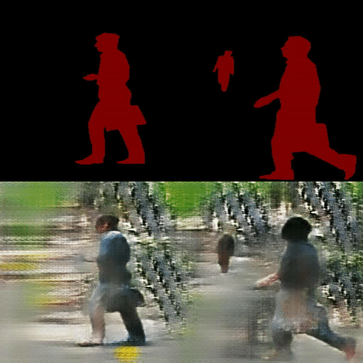

# pix2pixHD-huggan

> Code heavily relies on https://github.com/NVIDIA/pix2pixHD. Thanks to cool developers at NVIDIA.


### Small pedestrian dataset (Penn-Fudan dataset) results

```
Number of training samples: 159
Number of test samples: 10
Hyperparamers: Not tuned. stopped training at 71st epoch.
```

Intermediate generations during training:


Test sample results:



> **What is causing noisy BG but not so noisy person?**
> - Maybe side effect of small dataset
> - Maybe because semantic map is very sparse
